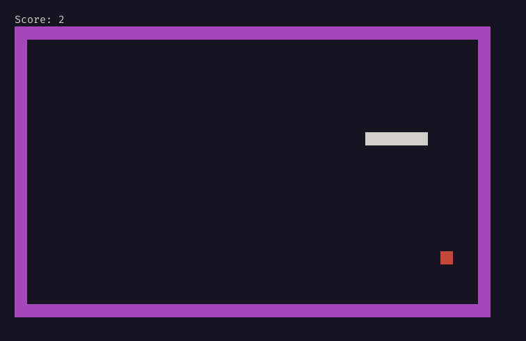

# Snake Game 🐍

This is a simple snake game made with Python that you can play in your terminal.



# Installation

First, clone this repository and `cd` into it:

```bash
git clone https://github.com/SkwalExe/snake-python.git
cd snake-python
```

Then, install the dependencies:

```bash
pip install -r requirements.txt
```

Finally, launch the game with python
    
```bash
python src/maibn.py
```

# Controls

- Use the arrow keys to move the snake
- Use `ESC` to quit the game
- Use `SPACE` to pause the game

# Structure of the project

## `main.py`

This file contains the main loop of the game, it is reponsible for controls.

## `game.py`

This file contains the logic of the game, it is reponsible for the snake, the food, the score, the rendering, etc.

## `colors.py`

This file contains the colors used in the game.

# final

If you have any problem, dont hesitate to open an issue.

# contributing

Pull requests are welcome. For major changes, please open an issue first to discuss what you would like to change.    